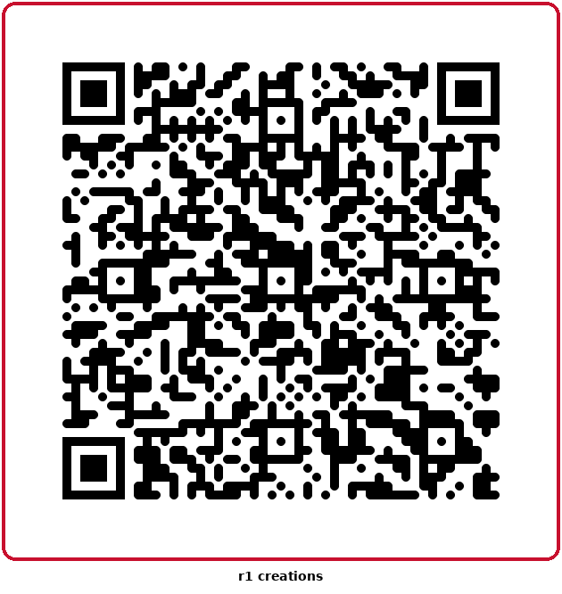

# MLB R1 Radio

Live MLB radio streaming app built for the Rabbit R1 screen (240x282).

**Live URL:** https://player585.github.io/MLB-R1-Radio/

## Install on R1

1. Scroll to the Creations card
2. Tap Create -> Add via QR code
3. Point camera at QR code above
4. Done

## Features

- Today's MLB games loaded automatically
- Tap Listen Now to expand radio links
- Scroll wheel support
- Rabbit R1 orange design
